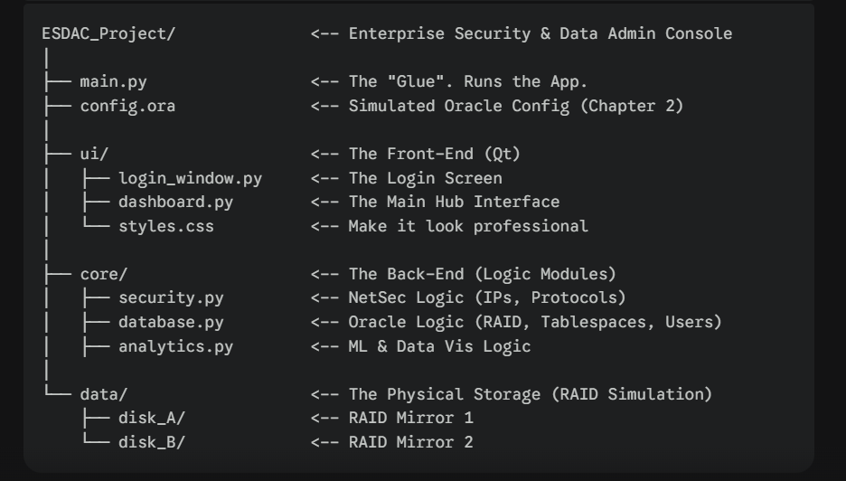

# ESDAC_Project (Enterprise Security & Data Administration Console)

## Description

This Project is a Desktop Application (built in Python + Qt) that allows user to

- Manage Oracle Database Users securely.
- Monitor Network Traffic and validate IP addresses.
- Visualize Threat Data using Machine Learning predictions.

The application is Fault Tolerant (RAID simulation) and adhere to strict Oracle Security Standards (Multi-tenant architecture).

## Files

